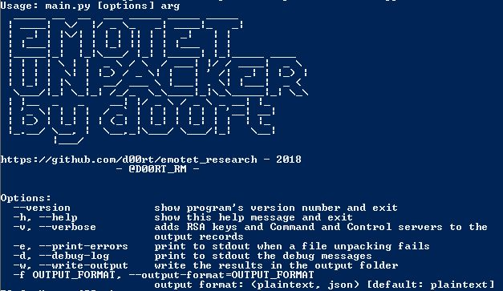

# Emotet research
In this repository you can find documentation about the packer of Emotet and its
unpacker. This unpacker extracts the command and controls, and the public RSA
key of Emotet (botnet identifier).



## General purpouse
The purpose of this repository is, to show how the packet of emotet works, 
provide a sample of emotet payload with its idc (made by me)

Also I wrote an unpacker for emotet (using TitanEngine) which extracts the final
payload of emotet and the intermediate layers for extracting it.

In addition, the unpackers extrats to a file the static configuration of emotet,
the command and controls and its public RSA key (botnet identifier).

## Directories and files
**./unpacker/src:**  
&nbsp;&nbsp;&nbsp;&nbsp;- Source code of the packer. **main.py** file is the 
script for running the unpacker.  
**./unpacker/TitanEngine.dll**  
&nbsp;&nbsp;&nbsp;&nbsp;- Titan Engine DLL, or you can download from
**reversinglabs.com**. The DLL must be on **C:/windows/system32/** folder.  
**./doc:**  
&nbsp;&nbsp;&nbsp;&nbsp;- Documentation of the emotet unpacker.  
**./unpacked_sample_id:**  
&nbsp;&nbsp;&nbsp;&nbsp;- In this directory you can find a sample of
final payload of the Emotet next to an idc documented by me.

## Requeriments
Before to use the unpacker, I recommend to read the documentation I did about
this packer. (./doc/EN_emotet_packer_analysis_and_config_extraction_v1.pdf)

* pyrhon2.7
* yara-python
* Titan Engine DLL. Provided in this repo, or you can download from its web page


## Output
If success a folder named "output" will be created.

**./output/unpacked/{packed_file_name}.emotet.unpacked:**  
&nbsp;&nbsp;&nbsp;&nbsp;- Emotet payload unpacked. (PE File)  
**./output/extracted_files/layer2/{packed_file_name}.layer2.bin:**  
&nbsp;&nbsp;&nbsp;&nbsp;- Layer2 of emotet packer. (PE File)  
**./output/extracted_files/broken_payload/{packed_file_name}.payload.bin:**  
&nbsp;&nbsp;&nbsp;&nbsp;- Emotet payload unpacked step 1, if you read the packer 
documentation you will realized that in the first step this file doesn't work,
it must be fixed up. (PE File)  
**./output/static_configuration/{packed_file_name}.ips.txt:**  
&nbsp;&nbsp;&nbsp;&nbsp;- List of "ip:port" of commands and controls.  
**./output/static_configuration/{packed_file_name}.rsa.txt:**  
&nbsp;&nbsp;&nbsp;&nbsp;- RSA key used for communicating with the command and
control.    
## Usage
After install all requeriments and the Titan Engine DLL...
```
cd unpacker/src/
./main.py [options] {filename or folder}
```


OR
```
double click :S
```


Then select the target file in the box.  
Press the "UnPack" buttom.  
Enjoy =)  

## Final words
These documentation and unpacker were done between November and December of 2018
if after these dates it doesn't work maybe the unpacker doesn't work well or
Emotet developers changed the packer.

This unpacker isn't perfect, it's my first dynamic unpacker using Titan Engine.
I did this research on my free time, because currently I'm not working on this 
kind of stuff and I don't have enough time.

It'd be cool keep the repository updated for new versions of the packer or for
some future error fixes. Therefore, feel free to send PR or open issues. I will
try to keep it updated if I have time.

Enjoy and keep fighting against the malware =)